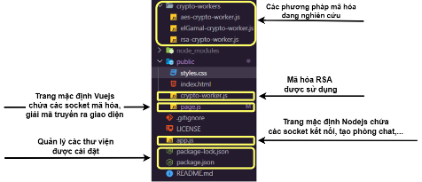
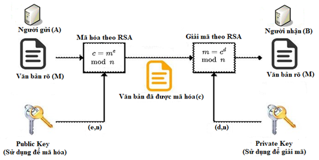
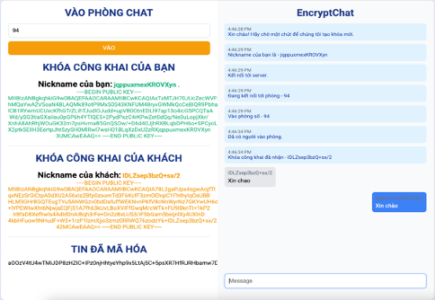

<h2 align="center">
    <a href="https://dainam.edu.vn/vi/khoa-cong-nghe-thong-tin">
        🎓 Faculty of Information Technology (DaiNam University)
    </a>
</h2>

<h2 align="center">
    Ứng dụng Nhắn Tin
</h2>

    

        
        
        
    

Đề tài này xây dựng một **ứng dụng nhắn tin trực tuyến** cho phép người dùng trò chuyện qua giao diện web.  
Hệ thống được thiết kế với giao diện đơn giản, dễ sử dụng và hỗ trợ giao tiếp theo thời gian thực.

---

## 👨‍💻 Tác giả
**Hoàng Anh Tú**

---

## ⚙️ Chức năng chính
- Gửi và nhận tin nhắn tức thì.  
- Tạo và tham gia phòng chat.  
- Hiển thị người dùng đang tham gia.  
- Giao diện thân thiện, dễ sử dụng.  

---

## 📸 Demo

### Cấu trúc chương trình

### Luồng xử lý

### Giao diện ứng dụng

---

## 📄 License
Dự án phục vụ mục đích học tập và nghiên cứu.  
Bạn có thể sử dụng và chỉnh sửa tự do.
